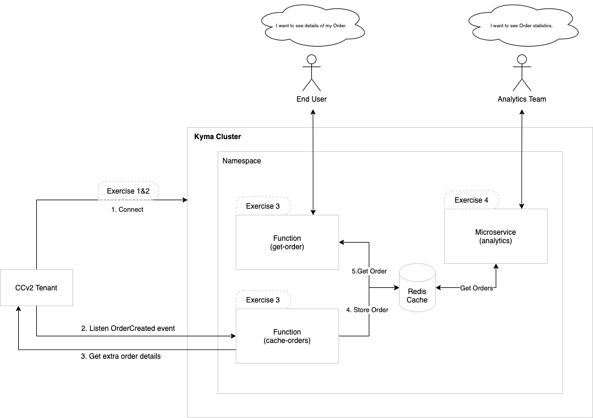

# Getting Started

In this section, you will have a look at the extension scenarios that you'll be implementing during the workshop and get access to the systems that will enable the upcoming exercises.

## Prepare The Environment

Before getting started with the exercises and extension scenario you have to get access to the following systems:

1. **SAP BTP, Kyma runtime free trial** - As part of the prerequisites, it is expected that every listener already has access to a free trial SAP BTP account and enabled the Kyma runtime.
2. **CCv2 tenant** - A list of provisioned tenants is shown below and will be distributed to the listeners based on attendance during the live session.

| Tenant Name | Storefront URL | Backoffice URL | Backoffice Credentials |
| ----------- | -------------- | -------------- | ---------------------- |
| Tenant 1 | https://jsapps.cp96avkh5f-techedses1-d2-public.model-t.cc.commerce.ondemand.com/ | https://backoffice.cp96avkh5f-techedses1-d2-public.model-t.cc.commerce.ondemand.com/backoffice | admin : ixiDhmYYT=:w:R6H!E2+gv!)P |
| Tenant 2 | https://jsapps.cp96avkh5f-techedses1-d3-public.model-t.cc.commerce.ondemand.com/ | https://backoffice.cp96avkh5f-techedses1-d3-public.model-t.cc.commerce.ondemand.com/backoffice | admin : PZNaL!1l86{;FTxMm<kG?bhoM |
| Tenant 3 | https://jsapps.cp96avkh5f-techedses1-d4-public.model-t.cc.commerce.ondemand.com/ | https://backoffice.cp96avkh5f-techedses1-d4-public.model-t.cc.commerce.ondemand.com/backoffice | admin : he_0;b4@vM;me[{l.AD1=&kyj |
| Tenant 4 | https://jsapps.cp96avkh5f-techedses1-d5-public.model-t.cc.commerce.ondemand.com/ | https://backoffice.cp96avkh5f-techedses1-d5-public.model-t.cc.commerce.ondemand.com/backoffice | admin : 7Jsb[,+eggc&8yqN(ot,k$OT: |
| Tenant 5 | https://jsapps.cp96avkh5f-techedses1-d6-public.model-t.cc.commerce.ondemand.com/ | https://backoffice.cp96avkh5f-techedses1-d6-public.model-t.cc.commerce.ondemand.com/backoffice | admin : dATvKq<WVvF30h:$&Q(()fGb, |
| Tenant 6 | https://jsapps.cp96avkh5f-techedses1-d7-public.model-t.cc.commerce.ondemand.com/ | https://backoffice.cp96avkh5f-techedses1-d7-public.model-t.cc.commerce.ondemand.com/backoffice | admin : p;Pw5z@fR4@jI]*3_73gZWVVN |
| Tenant 7 | https://jsapps.cp96avkh5f-techedses1-d8-public.model-t.cc.commerce.ondemand.com/ | https://backoffice.cp96avkh5f-techedses1-d8-public.model-t.cc.commerce.ondemand.com/backoffice | admin : 6t374HJ}13.xXKNpgAe}{O,)C |
| Tenant 8 | https://jsapps.cp96avkh5f-techedses1-d9-public.model-t.cc.commerce.ondemand.com/ | https://backoffice.cp96avkh5f-techedses1-d9-public.model-t.cc.commerce.ondemand.com/backoffice | admin : bcX8qC>$(c?7c2~Wtk81F4NEb |

**Note**: We will distribute the credentials for each tenant during the workshop.

## Extension Scenario

JohnDoe Electronics is an e-commerce business selling electronic appliances to customers all around the world. They are using SAP Commerce Cloud and all the features it has to offer to give customers the best overall experience. As their business is growing, they have some ideas on how to improve their online services and would like to explore and implement some extension options on their CCv2 platform. JohnDoe would like to implement the following improvements on their system:

1. Store all of their orders in a highly-available and peformant store like Redis - you will learn how to deploy a Function, Redis cache and connect Kyma with CCv2 Events and APIs.
2. Implement a customer-facing API that gives users information about their order - you will learn how to use a Kyma Function as an API.
3. Implement an API for the statistics team that retrieves common metrics - you will learn how to build and deploy an ExpressJS application in Kyma as a microservice.

In the upcoming exercises, you will be implementing these scenarios using the Kyma runtime for extending CCv2.

## Explore The Systems

Finally, it's helpful to have a first look at the main dashboards you'll be using in the following exercises, so please prepare and keep the tabs open on the side:

1. CCv2 Storefront
2. CCv2 Backoffice
3. SAP BTP
4. Kyma Dashboard

## Summary

Congratulations! You have now understood the extension scenarios that will be implemented during the workshop and got access to all the needed environments.

Continue to - [Exercise 1 - Connecting CCv2 to Kyma](../ex1/README.md)
