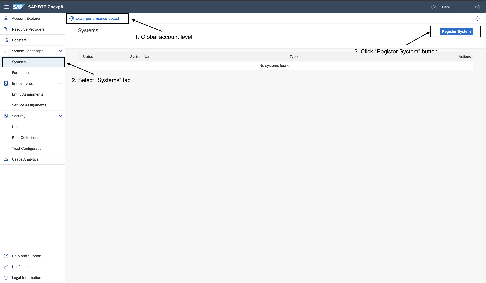
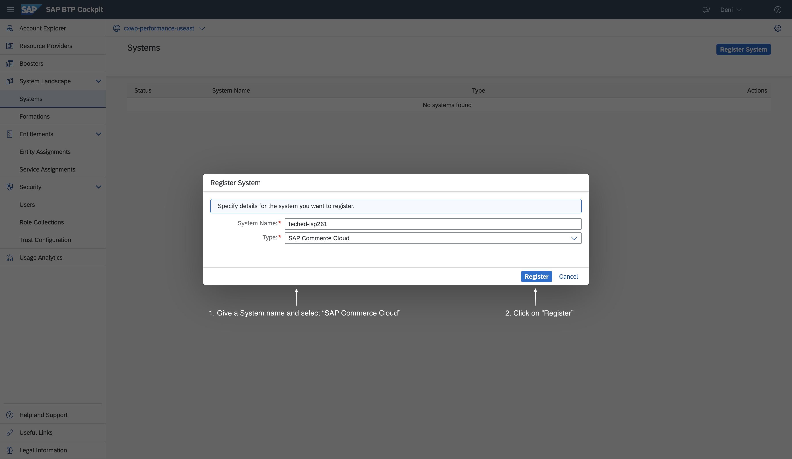
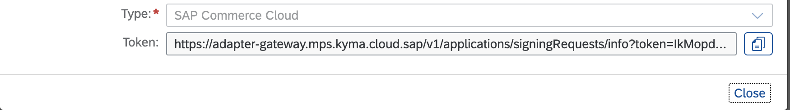
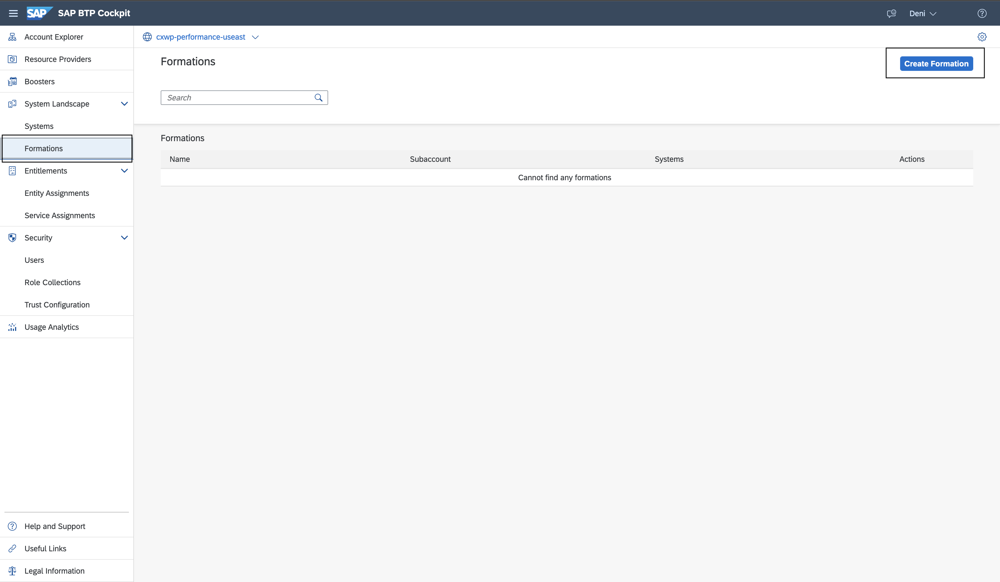
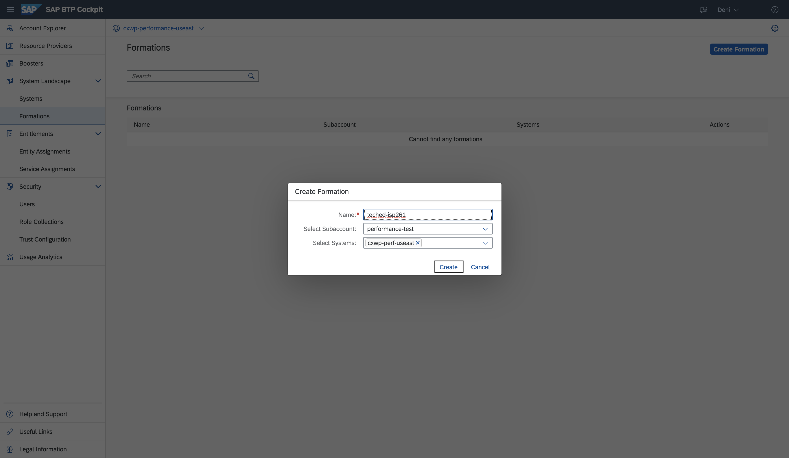
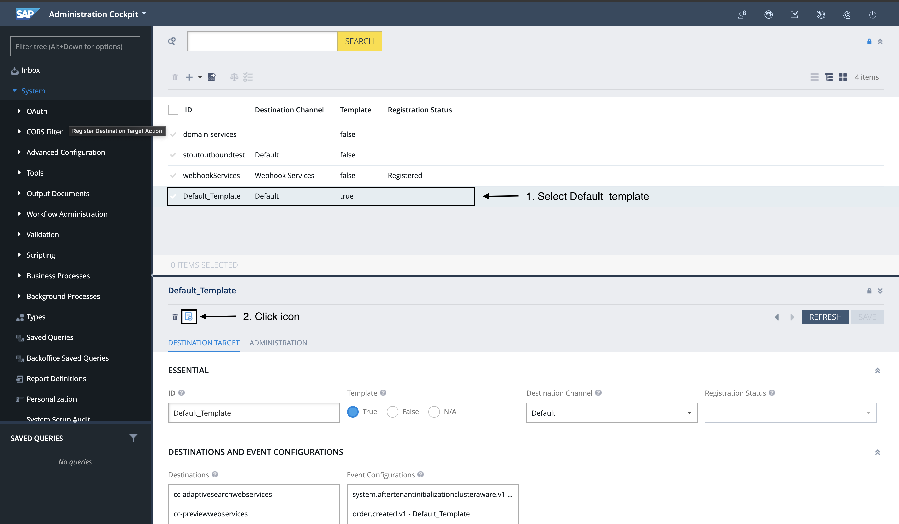
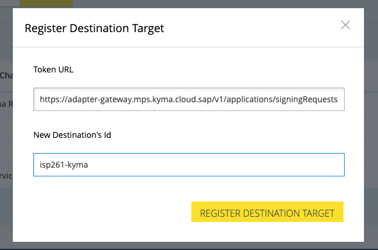
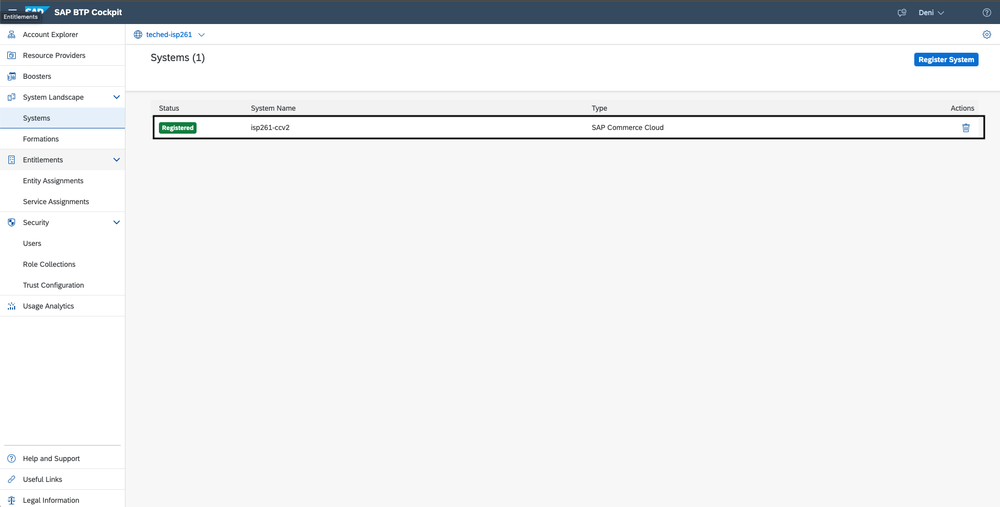
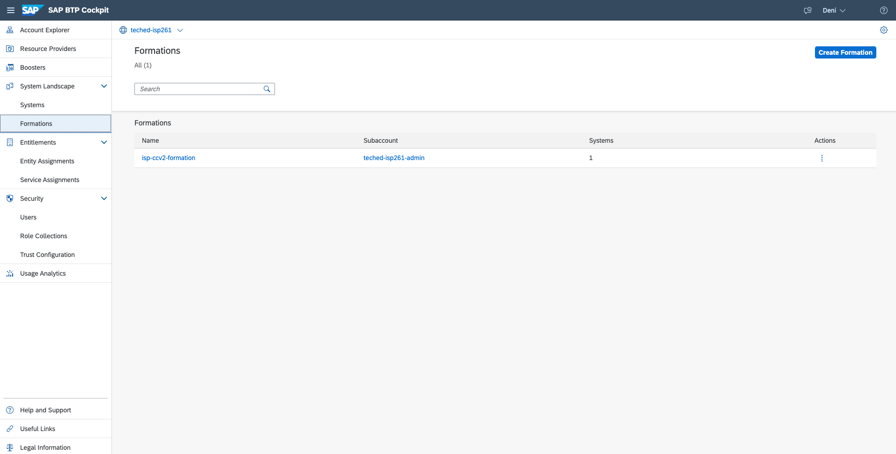
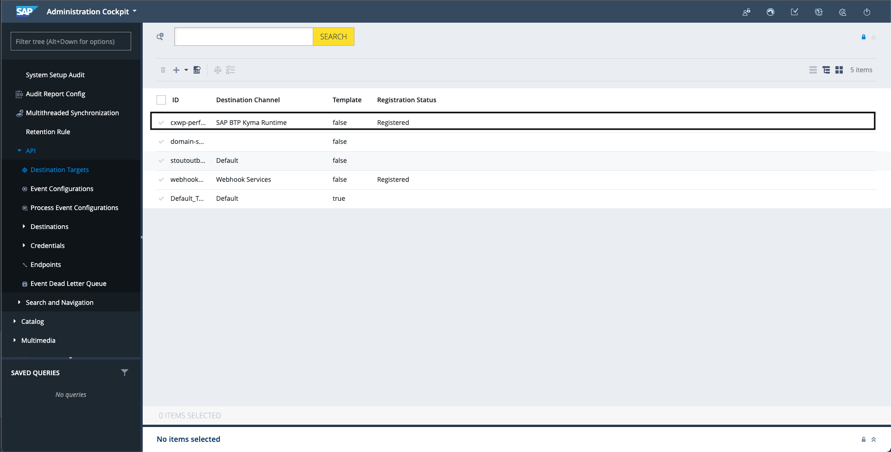

# Exercise 1 - Connect Kyma to CCv2

In this exercise, we will create a connection between CCv2 and SAP BTP, Kyma runtime. This way, we can start subscribing to events and consuming APIs coming from CCv2.

## Exercise 1.1 Create a System

In this step, you will create a System in the SAP BTP which will be used to pair the mock application to the Kyma runtime. This step will be performed at the Global account level of your SAP BTP account.

1. Open your global SAP BTP account and choose the System Landscape > Systems menu options.

2. Choose the Register System option, provide the name and set the type to SAP Commerce Cloud and then choose Register.

3. Copy the Token value and close the window. This value will expire in five minutes and will be needed in a subsequent step.

**Note**: If the token expires before use, you can obtain a new one by choosing the Display Token option shown next to the entry in the Systems list.

## Exercise 1.2 Create a Formation

In this step, you will create a Formation. A Formation is used to connect one or more Systems created in the SAP BTP to a runtime. This step will be performed at the Global account level of your SAP BTP account.

1. Within your global SAP BTP account, choose the System Landscape > Formations menu options. Choose the Create Formation option.

2. Provide a Name, choose your Subaccount where the Kyma runtime is enabled, choose the system name you created in the earlier step. Choose Create.

## Exercise 1.3 Pair an application ( CCv2 )

The pairing process will establish a trust between the CCv2 application and in this case the SAP Kyma runtime. Once the pairing is complete, the registration of APIs and business events can be performed. This process allow developers to utilize the APIs and business events with the authentication aspects handled automatically.

1. Navigate back to the CCv2 backoffice and go to System > API > Destination Targets. Select the `Default_template` and click on the icon next to the trash-bin to create a new Destination Target.

2. Paste the token you received from the System registration inside the `Token URL` field and give your connection a name. Click Register Destination Target.

## Exercise 1.4 Check connection

Now that the pairing process is completed, you can check if everything has completed successfully.

1. System created successfully

2. Formation created successfully

3. Backoffice, Kyma registered sucessfully

## Summary

Congratulations, you now have a working CCv2<->Kyma connection and are ready to move into the next exercise.

Continue to - [Exercise 2 - Exercise 2 Description](../ex2/README.md)
