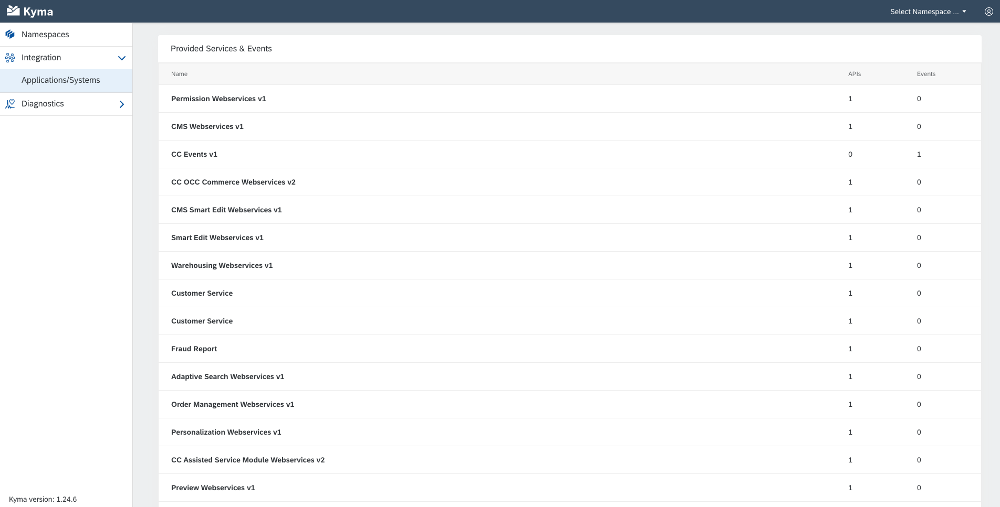
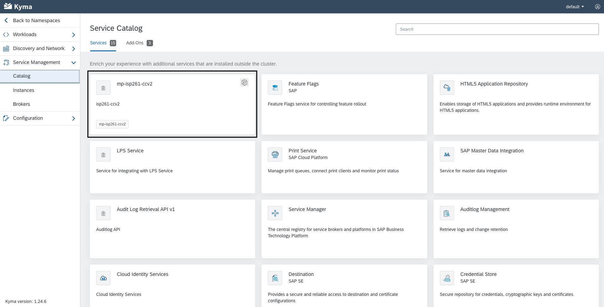

# Exercise 2 - Explore exposed APIs and Events

In this second exercise, you will create go through the events and APIs exposed from the connected CCv2 tenant and create the necessary steps to start using them.

## Exercise 2.1 Bind CCv2 to a namespace

As a prerequisite to start using the exposed services, you will bind the Commerce Mock application to the default namespace. This will allow the APIs and Events of CCv2 to be used within the namespace.

1. In the Kyma home workspace, choose Integration > Applications/Systems.
2. Choose the mp-commerce-mock application by clicking on the name value shown in the list.

3. Choose the option Create Binding.

4. In the Namespace select list choose the option `default` and then choose Create.

5. You should now see the list of Events/APIs from CCv2 that we can make use in our applications.

## Exercise 2.2 Create the Events service instance

To implement the extension scenarios the first thing we need are subscriptions to OrderCreated events. In this step you will subscribe to the Events service exposed from CCv2.

1. In the Kyma home workspace, choose Namespace and select the `default` namespace.

2. Within the dev namespace, choose Service Management > Catalog.

3. Choose the tile first Tile that indicates the CCv2 application. There you can view the Service Class Plans of the application.

1. Choose the Service Class Plan for CC Events v1. Choose Add and then Create to create a Service Instance.

You will then be landed in the newly created service instance, now ready to use.

## Exercise 2.3 Create the API service instance

You also need a CCv2 API that allows you to get additional order details. In this step you will subscribe to the OCC API service exposed from CCv2 that gives you access to those endpoints.

1. Following the same steps as the exercise above, choose Service Management > Catalog > CC OCC Commerce Webservices v2.

2. Choose Add and then Create to create a Service Instance.

## Exercise 2.4 View the Service Instances

In this step you will view the Events and the OCC Webservices service instances created in the previous two steps.

In the dev namespace, choose Service Management > Instances. This view will list the service instances existing in the namespace.

## Summary

You've now created service instances for Events and OCC APIs and you are ready to start implementing the extension scenarios.

Continue to - [Exercise 3 - Excercise 3 ](../ex3/README.md)
