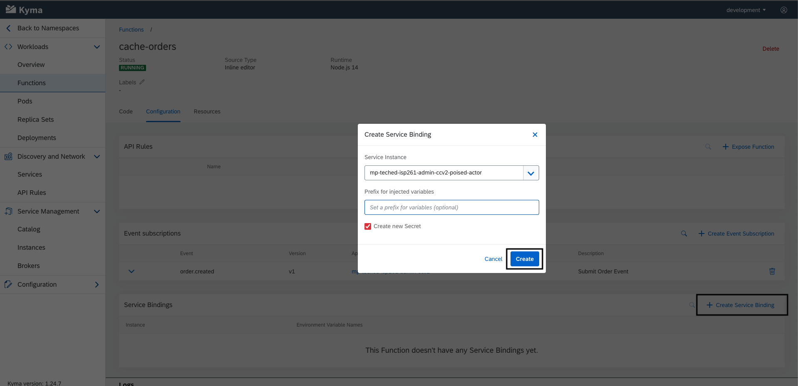
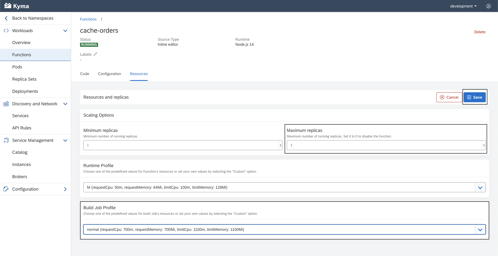

# Exercise 3 - Implementing Extension Scenario 1: Function

In this exercise you will implement the first extension scenario as mentioned in Getting Started.

# Exercise 3.1 - Deploy the Redis cache

As a first step, you will deploy the Redis cache in your Kyma runtime.

1. Copy the deployment file below and store it in a file called `redis-deployment.yaml` in your computer.

**_redis-deployment.yaml_**

```yaml
apiVersion: v1
kind: Secret
metadata:
  name: redis
  labels:
    app: redis
type: Opaque
data:
  quoted-redis-password: "ImtQcHBPWnAyaEMi"
  redis-password: "a1BwcE9acDJoQw=="
---
apiVersion: v1
kind: Service
metadata:
  name: redis
  labels:
    app: redis
spec:
  ports:
    - name: redis
      port: 6379
      targetPort: redis
  selector:
    app: redis
---
apiVersion: apps/v1
kind: Deployment
metadata:
  name: redis
  labels:
    app: redis
spec:
  replicas: 1
  strategy:
    rollingUpdate:
      maxUnavailable: 0
  selector:
    matchLabels:
      app: redis
  template:
    metadata:
      labels:
        app: redis
    spec:
      containers:
        - name: redis
          image: "bitnami/redis:latest"
          imagePullPolicy: "Always"
          env:
            - name: REDIS_PASSWORD
              valueFrom:
                secretKeyRef:
                  name: redis
                  key: quoted-redis-password
          ports:
            - name: redis
              containerPort: 6379
          livenessProbe:
            exec:
              command:
                - redis-cli
                - ping
            initialDelaySeconds: 30
            timeoutSeconds: 5
          readinessProbe:
            exec:
              command:
                - redis-cli
                - ping
            initialDelaySeconds: 5
            timeoutSeconds: 1
          resources:
            requests:
              memory: 256Mi
```

2. In the Kyma runtime, go inside the namespace that is connected to your CCv2 environment.


3. In the `Overview` section, select `Deploy new workload > Upload YAML`


4. Select or drop the `redis-deployment.yaml` file into the box and click `Deploy`.


5. Back in the `Overview` page, you should now see `2/2` successful Deployments and Pods. This means the Redis cache was successfully deployed and is ready to be used.


# Exercise 3.2 - Deploy your first Function

With a Redis cache in place, you can now start to implement the Function that will listen for events from CCv2 and place orders in the cache.

1. Back in the `Overview` page, click on `Deploy new workload > Create Function`


2. Give your new Function a new name like `cache-orders` and click `Create`


3. Wait until the Function turns into a `Running` status.


# Exercise 3.3 - Subscribe the Function to Events and APIs

1. In your Function view, go to the `Configuration` tab. There you should see the options to create Service Bindings and Event Subscriptions.


2. Click the `Create Event Subscription` button and check the box for `order.created` event. Click Save.


3. If the Event subscription is successful, you should see it under the Event subscription list.


4. Do the same for Service Bindings, select the already created `CCv2 API Service Instance` and click Create.



5. If the API Binding is successful, you should see it under the Service Bindings list.


# Exercise 3.4 - Test out the connection

While the function you deployed does not currently do much it still provides a useful functionality - it lets you know if the Kyma-CCv2 connection is working correctly. Let's test it.

1. Add the following line of code inside your Function and click `Save` on the top-right:

```js
module.exports = {
  main: async function (event, context) {
    console.log("Hello World");
    return "Hello World";
  },
};
```

We will be looking for this greeting when we trigger an Order Created event from CCv2.

2. Once your new Function is deployed, go to your CCv2 Storefront and create an account.


3. Place an order on any product of your choice.

_Note: You can use any Credit Card number/expiration/cvc combination to place the order i.e: `1234123412341234, 04/24, 123`_


4. Back in the Kyma runtime, go in the `Pods` tab and select the `... > Show Logs` for the `cache-orders` Pod. If the connection setup and Event Subscription is successful, CCv2 has triggered and event when the order was created.


_Note: We will soon look at another way we can trace the logs without peeking into the Pod!_

5. In the Logs you should look for and see a `Hello World` message persisted when the order was created. This confirms the connection is successful.


# Exercise 3.5 - Configure your Function resources

Kyma gives you the opportunity to configure your Function resources and match them accordingly with the expected load of your service. Let's have a look at the options and upscale the deployed Function.

1. In your Function view, go to the `Resources` tab and click the `Edit Configuration` button located on the top-right.


2. Set the `Maximum replicas` to 3 and `Build job profile` to M. This will make our Function autoscale up to 3 replicas in case of high load and make sure the Function is re-built quicker on every code change.

_Note: You can play around with Kyma pricing based on usage on [this calculator](https://estimator-don4txf2p3.dispatcher.ap1.hana.ondemand.com/index.html)_



Now, the stage is set to continue implementing the extension scenario.

# Exercise 3.6 - Implement the rest of your Function

The next step to the implementation is connecting the newly created Function with the deployed Redis cache. Let's start by adding the necessary code.

1. The first step is to add dependencies to external libraries

In the `Code` tab, you can find the `Dependencies` submenu. Add the following dependencies to the dependency object:

```json
{
  "dependencies": {
    "axios": "^0.18.1",
    "redis": "^3.0.2",
    "handy-redis": "^2.0.0"
  }
}
```

The final code should look similar to:


Now let's import the libraries in our code:

```js
const axios = require("axios");
const hredis = require("handy-redis");
```

We will be using `axios` for making an HTTP request back to CCv2 and `hredis` client to connect to the newly deployed Redis cache.
Also, since we will be making external HTTP calls in our main function, make sure to add the keyword `async`.

The final version should now look like this:

```js
const axios = require("axios");
const hredis = require("handy-redis");

module.exports = {
  main: async function (event, context) {
    console.log("Hello World");
    return "Hello World";
  },
};
```

2. The next step is making use of the Redis client to connect to the cache. Add this code right under the imports:

```js
const client = hredis.createNodeRedisClient({
  port: process.env["REDIS_PORT"],
  host: process.env["REDIS_HOST"],
  password: process.env["REDIS_PASSWORD"],
});
```

As you can see, we are making use of three environment variables to connect to the cache. To add these variables click on `Edit Envionment Variables` in the bottom panel.


Finally, add these values as environment variables:

```
SITE: electronics
REDIS_PORT: 6379
REDIS_PASSWORD: kPppOZp2hC
REDIS_HOST: redis.your_namespace_name.svc.cluster.local
```


_Don't forge to save the changes!_

3. To test out that the connection with Redis is successful, let's try to store some details about the order in the cache. Inside the `main` exported function, add the following code:

```js
const orderCode = event.data.orderCode;

console.log("Received orderCode: ", orderCode);

const isCached = cacheOrder(orderCode, orderValue, client);

console.log("Status of caching:", isCached);
```

And outside the `main` function, create a new function called cacheOrder as shown below:

```js
async function cacheOrder(orderCode) {
  const orderDate = new Date();

  console.log("Caching data to redis for orderCode: ", orderCode);

  return await client.hmset(
    orderCode,
    ["orderCode", orderCode],
    ["Date", orderDate]
  );
}
```

Save the code and wait for it to be in a `Running` state again before testing.

4. Time for another test! Let's create another order from CCv2 and look at the logged messages in the Pod console.

If everything is successful, you should see the following logs in your Pod:


5. The next step to our implementation is making a callback HTTP request to our CCv2 tenant. We can get the URL of the CCv2 tenant through an environment variable that is injected in our code from the `CC OCC Commerce Webservices v2` service binding.

Copy the full key name of the environment variable ending with `GATEWAY_URL` (not the value).


Then, add this code section right below your imports and replace the with the URL you copied earlier.

```js
const COMM_GATEWAY_URL = process.env["<REPLACE WITH GATEWAY_URL>"];
```

6. Now that we have the URL, let's implement the callback.

Add this function at the end of your code that implements the callback request:

```js
async function getOrderDetails(orderCode) {
  const ordersUrl = `${COMM_GATEWAY_URL}/${process.env.SITE}/orders/${orderCode}`;
  console.log(
    "Getting ordering details via: %s",
    ordersUrl,
    " for orderCode: ",
    orderCode
  );
  const response = await axios.get(ordersUrl);
  console.log(JSON.stringify(response.data, null, 2));
  return response.data;
}
```

Now let's use this function in our `main` function and callback CCv2 before storing the value in the cache.

Your main function should look like this:

```js
  main: async function (event, context) {
   const orderCode = event.data.orderCode;
   const response = await getOrderDetails(orderCode);
   const orderValue = response.totalPriceWithTax.value;

  console.log("Received order value of: ", orderValue, " for orderCode: ", orderCode);
  const isCached = await cacheOrder(orderCode, orderValue, client);
  console.log("Status of caching:", isCached);
  }
```

7. Time for the last test! Create a new order in CCv2 and take a look at the logs.

If the code of your Function looks similar to this:

```js
const axios = require("axios");
const hredis = require("handy-redis");
const COMM_GATEWAY_URL =
  process.env[
    "CC_OCC_COMMERCE_WEBSERVICES_V2_F19C9CE4_CFA2_40DE_80C8_C29E47B5EA4C_GATEWAY_URL"
  ];

const client = hredis.createNodeRedisClient({
  port: process.env["REDIS_PORT"],
  host: process.env["REDIS_HOST"],
  password: process.env["REDIS_PASSWORD"],
});

module.exports = {
  main: async function (event, context) {
    const orderCode = event.data.orderCode;
    const response = await getOrderDetails(orderCode);
    const orderValue = response.totalPriceWithTax.value;

    console.log(
      "Received order value of: ",
      orderValue,
      " for orderCode: ",
      orderCode
    );
    const isCached = await cacheOrder(orderCode, orderValue, client);
    console.log("Status of caching:", isCached);
  },
};

async function cacheOrder(orderCode, orderValue) {
  const orderDate = new Date();
  console.log("Caching data to redis for orderCode: ", orderCode);
  return await client.hmset(
    orderCode,
    ["orderCode", orderCode],
    ["orderValue", orderValue],
    ["Date", orderDate]
  );
}

async function getOrderDetails(orderCode) {
  const ordersUrl = `${COMM_GATEWAY_URL}/${process.env.SITE}/orders/${orderCode}`;
  console.log(
    "Getting ordering details via: %s",
    ordersUrl,
    " for orderCode: ",
    orderCode
  );
  const response = await axios.get(ordersUrl);
  console.log(JSON.stringify(response.data, null, 2));
  return response.data;
}
```

The logs of your Pod should end with these messages:


# Exercise 3.7 - Implement a small API

.. start implement the other function get-redis slowly
.. -> connect to redis and read

## Summary

Hooray! You've successfully completed [Exercise 3 - Implementing Extension Scenario 1: Function](#exercise-6---filtering-with-the-icontabbar).

Continue to [Exercise 4 - Fragment containing a SelectDialog](../ex4/README.md).

## Further Information

- Info

```

```
