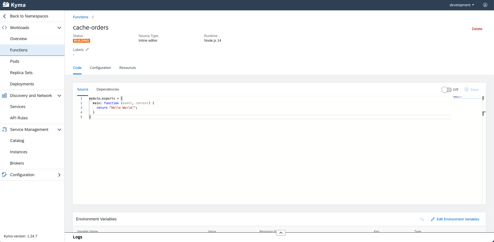
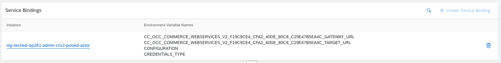

# Exercise 3 - Implementing Extension Scenario 1: Functions

In this exercise you will implement the first extension scenario for JonDoe electronics, more specifically, a Function for caching orders and a Function for retrieving orders.

# Exercise 3.1 - Deploy a Redis Cache

As a first step, let's start with deploying a Redis cache in the Kyma runtime.

1. Copy the code below and store it in a file called `redis-deployment.yaml` in your computer.

**_redis-deployment.yaml_**

```yaml
apiVersion: v1
kind: Secret
metadata:
  name: redis
  labels:
    app: redis
type: Opaque
data:
  quoted-redis-password: "ImtQcHBPWnAyaEMi"
  redis-password: "a1BwcE9acDJoQw=="
---
apiVersion: v1
kind: Service
metadata:
  name: redis
  labels:
    app: redis
spec:
  ports:
    - name: redis
      port: 6379
      targetPort: redis
  selector:
    app: redis
---
apiVersion: apps/v1
kind: Deployment
metadata:
  name: redis
  labels:
    app: redis
spec:
  replicas: 1
  strategy:
    rollingUpdate:
      maxUnavailable: 0
  selector:
    matchLabels:
      app: redis
  template:
    metadata:
      labels:
        app: redis
    spec:
      containers:
        - name: redis
          image: "bitnami/redis:latest"
          imagePullPolicy: "Always"
          env:
            - name: REDIS_PASSWORD
              valueFrom:
                secretKeyRef:
                  name: redis
                  key: quoted-redis-password
          ports:
            - name: redis
              containerPort: 6379
          livenessProbe:
            exec:
              command:
                - redis-cli
                - ping
            initialDelaySeconds: 30
            timeoutSeconds: 5
          readinessProbe:
            exec:
              command:
                - redis-cli
                - ping
            initialDelaySeconds: 5
            timeoutSeconds: 1
          resources:
            requests:
              memory: 256Mi
```

This code contains the necessary K8s resources like Deployment, Service and Secret to make Redis available in our Kyma runtime. You can read more on these Kubernetes resources [here](https://kubernetes.io/docs/concepts/).

2. In the Kyma runtime, go inside the namespace that is connected to your CCv2 environment. Look for `1 Bound Application` keyword.


3. In the `Overview` section, select `Deploy new workload > Upload YAML`


4. Browse or drop the `redis-deployment.yaml` file you created earlier into the box and click `Deploy`.


5. Back in the `Overview` page, you should now see `2/2` successful `Deployments` and `Pods`. This means the Redis cache was successfully deployed and is ready to be connected to.


You can also see all the deployed resources under the `Services` `Pods` `Deployments` and `Secrets` sections.

# Exercise 3.2 - Deploy Your First Function

With a Redis cache in place, you can now start to implement the Function that will listen for events from CCv2 and store those orders in the cache.

1. Back in the `Overview` page, click on `Deploy new workload > Create Function`


2. Give your new Function a new name like `cache-orders` and click `Create`. Leave the default runtime as `Node.js 14`.


3. Wait until the Function turns from `Building` to `Deploying` and into a `Running` status as depicted below.

> Status 1: Building



> Status 2: Deploying


> Status 3: Running


In the Source Code you can now probably only see a main function containing some skeleton code. This function is very important as it will be triggered by any event that we have subscribed to from CCv2!

# Exercise 3.3 - Subscribe The Function To Events and Bind To APIs

1. In the `Function` view, go to the `Configuration` tab. Under this tab the buttons to create `Service Bindings` and `Event Subscriptions` reside.


2. Click the `Create Event Subscription` button and check the box for `order.created` event. Click `Save`.


3. If the Event subscription is successful, you should see it under the Event subscription list.


4. Doing the same for Service Bindings, select the already created `CCv2 API Service Instance` and click `Create`.


5. If the API Binding is successful, you should see it under the Service Bindings list as depicted below.



As you can see in the image above, this binding to the OCC API will inject some environment variables into your Function so you can make the API calls back to CCv2!

# Exercise 3.4 - Test Out The Connection

While the function you deployed does not currently do much, it still provides a very useful functionality - it lets you know if the Kyma-CCv2 connection is working correctly. Let's test it.

1. Add the following line of code inside your Function and click `Save`.

```js
module.exports = {
  main: async function (event, context) {
    console.log("Hello World");
    return "Hello World";
  },
};
```

You will be looking for this `Hello World` greeting in the logs when we trigger an Order Created event from CCv2.

2. Once your new Function is deployed (remember: we're looking for a `Running` status) go to your CCv2 Storefront and create an account.


3. Once registered, you can place an order on any product of your choice. And don't worry, you don't need to spend any money - this one is on us 😊 We like to use **Card No: 4242424242424242 | Exp: 04/24 | CVC: 424**

> Choose Product.


> Add to Cart.


> Follow Checkout.


> Get Order Confirmation.


4. Back in the Kyma runtime, go in the `Pods` tab and select the `... > Show Logs` for the `cache-orders` Pod. If the connection setup and Event Subscription is successful, CCv2 has triggered an event when the order was created.


_Note: In the last exercise you will learn another way to trace logs without peeking into the Pod!_

5. In the log output you should now see a `Hello World` message persisted when the order was created. This confirms the connection is successful and events are coming through. Nice!


# Exercise 3.5 - Configure Your Function Resources

Kyma gives you the opportunity to configure your Function resources according to the expected load of your service. Let's have a look at the options provided and scale the deployed Function.

1. In your Function view, go to the `Resources` tab and click the `Edit Configuration` button located on the top-right.


1. Set the `Maximum replicas` to 3, `Build Job Profile` to normal and `Runtime Profile` to M. This will make the Function autoscale up to 3 replicas in case of high load and make sure the Function is re-built quicker on every code change. **Tip**: If you want to have X replicas available at all times, set the Minimum replica number to X!


_You can play around with Kyma pricing based on usage on [this calculator](https://estimator-don4txf2p3.dispatcher.ap1.hana.ondemand.com/index.html)._

Now, the stage is set to continue implementing the extension scenario.

# Exercise 3.6 - Implement The Rest of Your Function

The next step in our implementation is connecting the newly created Function with the deployed Redis cache. Let's start by adding the necessary code.

1. Let's begin by adding the necessary dependencies to your Function. In the `Code` tab, you can find the `Dependencies` submenu. Add the following dependencies and click `Save`:

```json
{
  "dependencies": {
    "axios": "^0.18.1",
    "redis": "^3.0.2",
    "handy-redis": "^2.0.0"
  }
}
```

Your code should now look similar to:


2. Next, let's import these libraries for use. Add the code below to the Function:

```js
const axios = require("axios");
const hredis = require("handy-redis");
```

We will be using `axios` for making an HTTP request back to CCv2 and `hredis` client to connect to the newly deployed Redis cache.
Also, since we will be making external HTTP calls in our main function, make sure to add the keyword `async`.

The final version should look similar to this:

```js
const axios = require("axios");
const hredis = require("handy-redis");

module.exports = {
  main: async function (event, context) {
    console.log("Hello World");
    return "Hello World";
  },
};
```

3. The next step is bootstrapping the Redis client that will help connect to the cache. Add this code right under your imports:

```js
const client = hredis.createNodeRedisClient({
  port: process.env["REDIS_PORT"],
  host: process.env["REDIS_HOST"],
  password: process.env["REDIS_PASSWORD"],
});
```

As you can see, the code is making use of three environment variables to connect to the cache. Unfortunately, these environment variables are not magical, they are injected from someone, and that someone is you. To add these variables, click on `Edit Envionment Variables` in the bottom panel.


Add these values as environment variables:

```
SITE: electronics
REDIS_PORT: 6379
REDIS_PASSWORD: kPppOZp2hC
REDIS_HOST: redis.your_namespace_name.svc.cluster.local
```


**Don't forget to save the changes!**

4. To test out that the connection with Redis is successful, let's try to store some details about received order events in the cache. Inside the `main` exported function, add the following code:

```js
const orderCode = event.data.orderCode;
console.log("Received orderCode: ", orderCode);

const isCached = await cacheOrder(orderCode);
console.log("Status of caching:", isCached);
```

And outside the `main` function, create a new function called `cacheOrder` as shown below:

```js
async function cacheOrder(orderCode) {
  const orderDate = new Date();

  console.log("Caching data to redis for orderCode: ", orderCode);

  return await client.hmset(
    // Store in Redis an entry with key: orderCode and values
    orderCode,
    ["orderCode", orderCode],
    ["Date", orderDate]
  );
}
```

Save the code and wait for it to be in a `Running` state again before testing.

5. Time for another test! Let's create another order from CCv2 and look at the logged messages inside the Pod console. If everything is successful, you should see the following logs in your Pod:


6. Perfect! Time to take it up a notch. Let's improve our implementation by making a callback HTTP request to the CCv2 tenant and get some extra details on your order. You can get the URL of the CCv2 tenant through an environment variable that is injected in our code from the `CC OCC Commerce Webservices v2` service binding.

Copy the full key name of the environment variable ending with `GATEWAY_URL` (careful: you need the name, NOT the value).


Then, add this code section right below your imports and replace `<REPLACE WITH GATEWAY_URL>` with the URL you copied earlier.

```js
const COMM_GATEWAY_URL = process.env["<REPLACE WITH GATEWAY_URL>"];
```

7. Now that you have access to the CCv2 URL, let's implement the callback. Add this function at the end of your code:

```js
async function getOrderDetails(orderCode) {
  const ordersUrl = `${COMM_GATEWAY_URL}/${process.env.SITE}/orders/${orderCode}`; // Construct the correct endpoint
  console.log(
    "Getting ordering details via:",
    ordersUrl,
    " for orderCode: ",
    orderCode
  );

  const response = await axios.get(ordersUrl); // GET request to CCv2 tenant Orders endpoint
  console.log(JSON.stringify(response.data, null, 2));

  return response.data;
}
```

You can explore the CCv2 OCC API endpoints also in this [link](https://api.sap.com/api/commerce_services/resource).

8. Let's use the `getOrderDetails` function in the `main` function and callback CCv2 before storing the value in the cache. Your main function should look like this:

```js
  main: async function (event, context) {
   const orderCode = event.data.orderCode; // Get order code from the event
   const response = await getOrderDetails(orderCode); // Callback to CCv2 and receive extra details
   const orderValue = response.totalPriceWithTax.value; // Extract the price of the order

  console.log("Received order value of: ", orderValue, " for orderCode: ", orderCode);
  const isCached = await cacheOrder(orderCode, orderValue); // Cache data in Redis
  console.log("Status of caching:", isCached);
  }
```

9. Well done! Time for the last test. Let's create a new order in CCv2 and take a look at the Pod logs. If the code of your Function looks similar to this:

```js
const axios = require("axios");
const hredis = require("handy-redis");
const COMM_GATEWAY_URL =
  process.env[
    "CC_OCC_COMMERCE_WEBSERVICES_V2_F19C9CE4_CFA2_40DE_80C8_C29E47B5EA4C_GATEWAY_URL"
  ];

const client = hredis.createNodeRedisClient({
  port: process.env["REDIS_PORT"],
  host: process.env["REDIS_HOST"],
  password: process.env["REDIS_PASSWORD"],
});

module.exports = {
  main: async function (event, context) {
    const orderCode = event.data.orderCode;
    const response = await getOrderDetails(orderCode);
    const orderValue = response.totalPriceWithTax.value;

    console.log(
      "Received order value of: ",
      orderValue,
      " for orderCode: ",
      orderCode
    );
    const isCached = await cacheOrder(orderCode, orderValue);
    console.log("Status of caching:", isCached);
  },
};

async function cacheOrder(orderCode, orderValue) {
  const orderDate = new Date();
  console.log("Caching data to redis for orderCode: ", orderCode);

  return await client.hmset(
    orderCode,
    ["orderCode", orderCode],
    ["orderValue", orderValue],
    ["Date", orderDate]
  );
}

async function getOrderDetails(orderCode) {
  const ordersUrl = `${COMM_GATEWAY_URL}/${process.env.SITE}/orders/${orderCode}`;
  console.log(
    "Getting ordering details via: %s",
    ordersUrl,
    " for orderCode: ",
    orderCode
  );

  const response = await axios.get(ordersUrl);
  console.log(JSON.stringify(response.data, null, 2));

  return response.data;
}
```

The logs of your Pod should end with these messages:


# Exercise 3.7 - Implement a Reading API

Woah, that was intense! But this exercise is not over yet. The next and final step is to deploy a Function that will allow us to read values stored in the Cache from customers via a public API.

1. Create another Function called `get-orders` from the Kyma dashboard as demonstrated in the last exercise.


2. Add the following dependencies:

```json
 "dependencies": {
      "redis":  "^3.0.2",
      "handy-redis": "^2.0.0"
  }
```

3. Then, include these environment variables:

```
REDIS_PORT: 6379
REDIS_PASSWORD: kPppOZp2hC
REDIS_HOST: redis.your_namespace_name.svc.cluster.local
```

4. Now it's time to import the Redis libraries and connect to the cache by adding just like below:

```js
const hredis = require("handy-redis");

const client = hredis.createNodeRedisClient({
  port: process.env["REDIS_PORT"],
  host: process.env["REDIS_HOST"],
  password: process.env["REDIS_PASSWORD"],
});
```

5. Great! The next step is to create a helper function that will read data from the Cache whenever it is given an order code:

```js
async function processGetRequest(orderCode) {
  if (orderCode !== undefined) {
    console.log("getting order from cache: ", orderCode);
    return await client.hgetall(orderCode); // Get data from Redis with the given orderCode key
  } else {
    throw "No orderCode received!";
  }
}
```

6. Finally, let's wrap-up the main function. It will use the `processGetRequest` written in the earlier step as shown:

```js
try {
  const orderCode = event.extensions.request.query.orderCode; // Get order code
  let result = await processGetRequest(orderCode); // Get entry from Redis
  return result ? result : { error: "orderCode was not found" }; // Return result to user
} catch (err) {
  console.log("an error occurred...", err);
  event.extensions.response.status(500).json({ error: err });
}
```

Now it's time to save the new code and wait for it to redeploy!

7. In order to access and communicate with the new API from the outside world we need to configure a Kyma CRD called APIRule (more information on APIRule [here](https://kyma-project.io/docs/kyma/latest/05-technical-reference/00-custom-resources/apix-01-apirule)):

_*get-order.yaml*_

```yaml
apiVersion: gateway.kyma-project.io/v1alpha1
kind: APIRule
metadata:
  name: get-order
spec:
  gateway: kyma-gateway.kyma-system.svc.cluster.local
  rules:
    - path: /.*
      accessStrategies:
        - config: {}
          handler: noop
      methods:
        - GET # allow GET requests
  service:
    host: get-orders # map them to this host on port 80
    name: get-orders
    port: 80
```

Copy this code and store it in a file called `get-order.yaml`.

8. Back in the `Overview` section of the Kyma dashboard, select `Deploy new workload > Upload YAML` and drop the `get-order.yaml` file. Click `Deploy`.


9. Navigate to the `API Rules` tab and you should see the newly deployed `get-order` API Rule.

10. Click on the small arrow next to the name and adjust the URL to include an order code as a query parameter:

> https://get-orders.c-25ddfa3.kyma.shoot.live.k8s-hana.ondemand.com/?orderCode=code-from-your-order


11. Check the response! If everything is correctly configured you should now see the details of the order.


## Summary

Hooray! You've successfully completed [Exercise 3 - Implementing Extension Scenario 1: Function](#exercise-3---implementing-extension-scenario-1:-function).

Continue to [Exercise 4 - Implementing Extension Scenario 2: Microservice](../ex4/README.MD).
