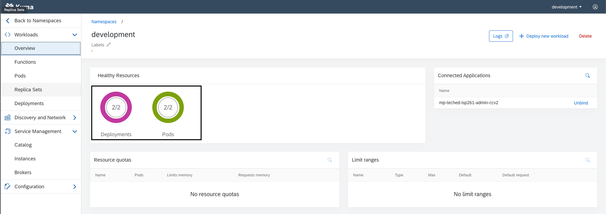

# Exercise 3 - Implementing Extension Scenario 1: Function

In this exercise you will implement the first extension scenario as mentioned in Getting Started.

# Exercise 3.1 - Deploy the Redis cache

As a first step, you will deploy the Redis cache in your Kyma runtime.

1. Copy the deployment file below and store in a file called `redis-deployment.yaml` in your computer.
   **_redis-deployment.yaml_**

```yaml
apiVersion: v1
kind: Secret
metadata:
  name: redis
  labels:
    app: redis
type: Opaque
data:
  quoted-redis-password: "ImtQcHBPWnAyaEMi"
  redis-password: "a1BwcE9acDJoQw=="
---
apiVersion: v1
kind: Service
metadata:
  name: redis
  labels:
    app: redis
spec:
  ports:
    - name: redis
      port: 6379
      targetPort: redis
  selector:
    app: redis
---
apiVersion: apps/v1
kind: Deployment
metadata:
  name: redis
  labels:
    app: redis
spec:
  replicas: 1
  strategy:
    rollingUpdate:
      maxUnavailable: 0
  selector:
    matchLabels:
      app: redis
  template:
    metadata:
      labels:
        app: redis
    spec:
      containers:
        - name: redis
          image: "bitnami/redis:latest"
          imagePullPolicy: "Always"
          env:
            - name: REDIS_PASSWORD
              valueFrom:
                secretKeyRef:
                  name: redis
                  key: quoted-redis-password
          ports:
            - name: redis
              containerPort: 6379
          livenessProbe:
            exec:
              command:
                - redis-cli
                - ping
            initialDelaySeconds: 30
            timeoutSeconds: 5
          readinessProbe:
            exec:
              command:
                - redis-cli
                - ping
            initialDelaySeconds: 5
            timeoutSeconds: 1
          resources:
            requests:
              memory: 256Mi
```

2. In the Kyma runtime, go inside the namespace that is connected to your CCv2 environment.


3. In the `Overview` section, select `Deploy new workload > Upload YAML`


4. Select or drop the `redis-deployment.yaml` file from step 1 into the box and click `Deploy`.


5. Back in the `Overview` page, you should now see 2/2 successful Deployments and Pods. This means the Redis cache was successfully deployed and is ready to be used.



# Exercise 3.2 - Deploy your first Function

.. Deploy the empty function configuration
.. start implementing the cache-order function slowly
.. -> add configuration ( event listening and API service binding )
.. -> configure replicas and other configurations
.. -> connect to redis, make callback API call, store to redis

# Exercise 3.3 - Deploy your API

.. start implement the other function get-redis slowly
.. -> connect to redis and read

## Summary

Hooray! You've successfully completed [Exercise 3 - Implementing Extension Scenario 1: Function](#exercise-6---filtering-with-the-icontabbar).

Continue to [Exercise 4 - Fragment containing a SelectDialog](../ex4/README.md).

## Further Information

- Info
