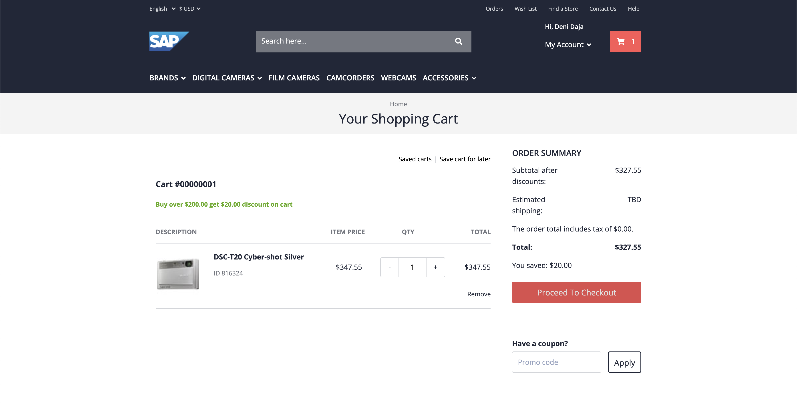

# Exercise 3 - Implementing Extension Scenario 1: Function

In this exercise you will implement the first extension scenario as mentioned in Getting Started.

# Exercise 3.1 - Deploy the Redis cache

As a first step, you will deploy the Redis cache in your Kyma runtime.

1. Copy the deployment file below and store it in a file called `redis-deployment.yaml` in your computer.

**_redis-deployment.yaml_**

```yaml
apiVersion: v1
kind: Secret
metadata:
  name: redis
  labels:
    app: redis
type: Opaque
data:
  quoted-redis-password: "ImtQcHBPWnAyaEMi"
  redis-password: "a1BwcE9acDJoQw=="
---
apiVersion: v1
kind: Service
metadata:
  name: redis
  labels:
    app: redis
spec:
  ports:
    - name: redis
      port: 6379
      targetPort: redis
  selector:
    app: redis
---
apiVersion: apps/v1
kind: Deployment
metadata:
  name: redis
  labels:
    app: redis
spec:
  replicas: 1
  strategy:
    rollingUpdate:
      maxUnavailable: 0
  selector:
    matchLabels:
      app: redis
  template:
    metadata:
      labels:
        app: redis
    spec:
      containers:
        - name: redis
          image: "bitnami/redis:latest"
          imagePullPolicy: "Always"
          env:
            - name: REDIS_PASSWORD
              valueFrom:
                secretKeyRef:
                  name: redis
                  key: quoted-redis-password
          ports:
            - name: redis
              containerPort: 6379
          livenessProbe:
            exec:
              command:
                - redis-cli
                - ping
            initialDelaySeconds: 30
            timeoutSeconds: 5
          readinessProbe:
            exec:
              command:
                - redis-cli
                - ping
            initialDelaySeconds: 5
            timeoutSeconds: 1
          resources:
            requests:
              memory: 256Mi
```

2. In the Kyma runtime, go inside the namespace that is connected to your CCv2 environment.


3. In the `Overview` section, select `Deploy new workload > Upload YAML`


1. Select or drop the `redis-deployment.yaml` file into the box and click `Deploy`.


5. Back in the `Overview` page, you should now see `2/2` successful Deployments and Pods. This means the Redis cache was successfully deployed and is ready to be used.


# Exercise 3.2 - Deploy your first Function

With a Redis cache in place, you can now start to implement the Function that will listen for events from CCv2 and place orders in the cache.

1. Back in the `Overview` page, click on `Deploy new workload > Create Function`


2. Give your new Function a new name like `cache-orders` and click `Create`


3. Wait until the Function turns into a `Running` status.


# Exercise 3.3 - Subscribe the Function to Events and APIs

1. In your Function view, go to the `Configuration` tab. There you should see the options to create Service Bindings and Event Subscriptions.


2. Click the `Create Event Subscription` button and check the box for `order.created` event. Click Save.


3. If the Event subscription is successful, you should see it under the Event subscription list.


4. Do the same for Service Bindings, select the already created `CCv2 API Service Instance` and click Create.


5. If the API Binding is successful, you should see it under the Service Bindings list.


# Exercise 3.4 - Test out the connection

While the function you deployed does not currently do much it still provides a useful functionality - it lets you know if the Kyma-CCv2 connection is working correctly. Let's test it.

1. Add the following line of code inside your Function and click `Save` on the top-right:

```js
module.exports = {
  main: async function (event, context) {
    console.log("Hello World");
    return "Hello World";
  },
};
```

We will be looking for this greeting when we trigger an Order Created event from CCv2.

2. Once your new Function is deployed, go to your CCv2 Storefront and create an account.


3. Place an order on any product of your choice.





4. Back in the Kyma runtime, go in the `Pods` tab and select the `... > Show Logs` for the `cache-orders` Pod. If the connection setup and Event Subscription is successful, CCv2 has triggered and event when the order was created.


5. In the Logs you should look for and see a `Hello World` message persisted when the order was created. This confirms the connection is successful.


# Exercise 3.5 - Configure your Function capabilities

.. -> configure replicas and other configurations

# Exercise 3.6 - Implement the rest of your Function

.. -> connect to redis, make callback API call, store to redis

# Exercise 3.7 - Implement a small API

.. start implement the other function get-redis slowly
.. -> connect to redis and read

## Summary

Hooray! You've successfully completed [Exercise 3 - Implementing Extension Scenario 1: Function](#exercise-6---filtering-with-the-icontabbar).

Continue to [Exercise 4 - Fragment containing a SelectDialog](../ex4/README.md).

## Further Information

- Info
