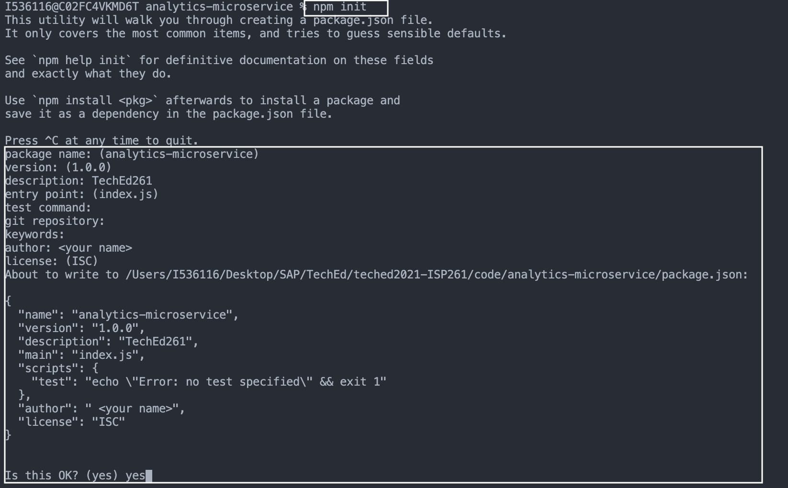
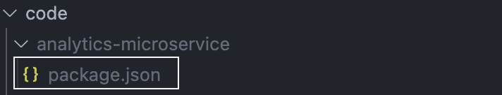

# Exercise 4 - Implementing Extension Scenario 2: Microservice

In this exercise you will implement the second extension scenario as mentioned in Getting Started - an Express.js microservice that will expose several API endpoints that retrieve common statistics on the orders.

# Exercise 4.1 - Bootstrap the project

As a first step, you will bootstrap the Expressjs application.

1. Create an empty folder and name it `analytics-microservice`

2. As this will be a Node.js application, let's begin by creating an npm package inside with the command `npm init` and completing the wizard



3. You should now see a `package.json` file generated inside the project. Great job!



4. The next step is to create a file called `index.js`, this will be the main entrypoint of our service.

5. Next, let's add the projects dependencies. In a terminal inside the project foler run: `npm i express cors body-parser handy-redis redis`. If successful, the content of your `package.json` should be similar to:

```json
{
  "name": "analytics-microservice",
  "version": "1.0.0",
  "description": "TechEd261",
  "main": "index.js",
  "scripts": {
    "test": "echo \"Error: no test specified\" && exit 1"
  },
  "author": "<your name>",
  "license": "ISC",
  "dependencies": {
    "body-parser": "^1.19.0",
    "cors": "^2.8.5",
    "express": "^4.17.1",
    "handy-redis": "^2.3.1",
    "redis": "^3.1.2"
  }
}
```

6. Add this code inside `index.js`

```js
const express = require("express");
const hredis = require("handy-redis");
const cors = require("cors");

const app = express();
const PORT = 8080;

app.use(cors());

app.get("/hello-world", async (req, res) => {
  res.status(200).send({ message: "Hello World!" });
});

app.listen(PORT, () => {
  console.log(`Microservice listening at port ${PORT}.`);
});
```

1. Inside a terminal in the project folder run: `node index.js`
2. Go to your favourite browser and type in the URL bar the following: `http://localhost:8080/hello-world`.


If you see the same thing in your screen, congratulations! You have successfully bootstrapped our microservice.

9. As a final step, to follow best-practices, add this line to your `package.json` file under `scripts` section:

```js
  "start": "node index.js",
```

Now you can easily run the server by following the well-known command `npm run start` in your terminal.

# Exercise 4.2 - Dockerize the microservice

As we will connect our service with the Redis cache located in the Kyma runtime, let's deploy the Express.js server in Kyma before we move on with the rest of the implementation. The first step we have to take is to Dockerize the application.

1. Inside the project folder create two files named `Dockerfile` and `.dockerignore`
2. Add the following code to the `Dockerfile`

```js
FROM node:11-alpine

RUN mkdir -p /usr/src/app

WORKDIR /usr/src/app

COPY . .

RUN npm install

EXPOSE 8080

CMD ["npm", "run", "start"]
```

3. Add the following code to the `.dockerignore`

```
node_modules
```

This will prevent our local libraries from being copied over to the Docker container. We don't need them as we install these libraries in the container separately. `node_modules` can contain binaries compiled for your host OS, and if it’s different then the container OS, you’ll get errors trying to run your app when you’re bind-mounting it from the host for development.

4. Time to build our first Docker image and push it to Dockerhub. Let's write the deploy script by creating a file named `Makefile` inside your project repo

5. Paste the following code inside your `Makefile` and replace <your-name> with a real value. Make sure you run `docker login` beforehand!

```Makefile
deploy:
	docker build -t <your-name>/analytics-microservice -f Dockerfile . && docker push <your-name>/analytics-microservice
```

_Note: If you don't have a Docker account to push your images don't worry! We will provide an image for the rest of the exercises._

6. Test out the deployment by running `make deploy` on a terminal and watch for the output


# Exercise 4.3 - Time for Kubernetes

Time to deploy! Let's write the necessary K8s configuration to have our application in Kyma.

> Create a new folder called `k8s` in the project folder.

1. Implement the ConfigMap

As a first step we need to inject some environment variables to the microservice. In Kubernetes, there are two resources that enable you to do this: `ConfigMap` and `Secret`. As a best practice, all sensitive environment variables should be injected via a `Secret` and the rest of the variables are to be injected through a `ConfigMap`.

Create a file called `configmap.yaml` and add the following code:

```yaml
apiVersion: v1
kind: ConfigMap
metadata:
  name: analytics-microservice
  labels:
    app: analytics-microservice
data:
  host: redis.development.svc.cluster.local
  port: "6379"
  password: kPppOZp2hC
```

Create a file called `secret.yaml` and add the following code:

```yaml
apiVersion: v1
kind: Secret
metadata:
  name: analytics-microservice
  labels:
    app: analytics-microservice
type: Opaque
data:
  password: "kPppOZp2hC"
```

2. Implement the Deployment and Service

Next, let's implement the Deployment that will create the Pods, and the Service that exposes these Pods for use.

Create a file called `deployment.yaml` and add the following code:

```yaml
apiVersion: apps/v1
kind: Deployment
metadata:
  name: analytics-microservice
  labels:
    app: analytics-microservice
spec:
  replicas: 1
  selector:
    matchLabels:
      app: analytics-microservice
  template:
    metadata:
      labels:
        app: analytics-microservice
    spec:
      containers:
        - image: ddaja/analytics-microservice:latest # if you managed to deploy your own Docker image, replace this string
          imagePullPolicy: Always
          name: analytics-microservice
          ports:
            - name: http
              containerPort: 8080
          env:
            - name: host
              valueFrom:
                configMapKeyRef: # get hostname from configMap
                  name: analytics-microservice
                  key: host
            - name: port
              valueFrom:
                configMapKeyRef:
                  name: analytics-microservice
                  key: port : # get port from configMap
            - name: password
              valueFrom:
                secretKeyRef:
                  name: analytics-microservice
                  key: password # get password from Secret
```

In the same file, add the service implementation as below:

```yaml
---
apiVersion: v1
kind: Service
metadata:
  name: analytics-microservice
  labels:
    app: analytics-microservice
spec:
  ports:
    - name: http
      port: 8080
      targetPort: 8080
      protocol: TCP
  selector:
    app: analytics-microservice
```

3. Implement the APIRule

Finally, we need to make this deployed microservice accessible to the outside world. As an Ingress, we will use the Kyma APIRule, so create a file called `apirule.yaml` and add the code below:

```yaml
apiVersion: gateway.kyma-project.io/v1alpha1
kind: APIRule
metadata:
  name: analytics-microservice
spec:
  gateway: kyma-gateway.kyma-system.svc.cluster.local
  rules:
    - path: /average|/highest|/lowest|/keys|/delete # endpoints that will be implemented in the microservice
      accessStrategies:
        - config: {}
          handler: noop
      methods:
        - GET # all routes are accessible via GET
  service:
    host: analytics-microservice # requests will route to analytics-microservice service
    name: analytics-microservice
    port: 8080
```

# Exercise 4.4 - Deploy resources into Kyma

Let's deploy our newly created resources. Go to the `Overview > Deploy new workload > Upload YAML` and deploy the services in the following order:

1. `configmap.yaml`
2. `secret.yaml`
3. `deployment.yaml`
4. `apirule.yaml`

Check that all Deployments and Pods are successfully created in the `Overview > Healthy Resources` section.


# Exercise 4.5 - Implement the rest of the microservice

Let's add the rest of the implementation in our `index.js` file.

1. Add the connection to Redis as shown below:

```js
const client = hredis.createNodeRedisClient({
  port: process.env["port"],
  host: process.env["host"],
  password: process.env["password"],
});
```

2. At the end of the file, add the following helper function:

```js
async function getResultFromCache() {
  try {
    const keys = await client.keys("*");
    let values = [];

    for (let i = 0; i < keys.length; i++) {
      const value = await client.hgetall(keys[i]);
      values = [...values, value];
    }

    return values;
  } catch (err) {
    throw new Error(err);
  }
}
```

This function will return to us all the product values currently stored in the Redis cache.

4. Add a helper endpoint:

```js
app.get("/keys", async (req, res) => {
  const keys = await client.keys("*");
  res.status(200).send({ keys });
});
```

This endpoint will enable us to see which product keys are currently stored in the cache. We will use this endpoint continuously in the next steps!

5. Time to redeploy the microservice with our latest changes.

-> Run `make deploy`
-> Once successfully deployed, delete the `analytics-microservice` Pod so it gets recreated and pulls the latest image.


6. Cleanup the cache

Before we implement some simple analytics endpoints, let's clear out our Redis cache.

Go to `Pods`, click on the three dots on the `redis-xyz-xyz` Pod and `Delete`.


7. Test our new endpoint through the `APIRule`

Go to `API Rules` and find the URL of the `analytics-microservice`.

Open the URL in a new tab and attach the endpoint `/keys` at the end.

The finishing URL and result should be similar to:


We see we don't have any keys stored in the Cache because we already cleared it in the previous step.

8. Make two additional orders in CCv2 and check the `/keys` endpoint. **Keep an eye on the prices, we will make some statistics on them!**

Depending on the products you bought, you should see something similar:


We are now ready to implement some endpoints and play around with the product prices.

9. Let's add three endpoints to our microservice, `/average`, `/highest`, `/lowest`.

# Exercise 4.6 - Test out our endpoints

## Summary

Hooray! You've successfully completed [Exercise 3 - Implementing Extension Scenario 1: Function](#exercise-3---implementing-extension-scenario-1:-function).

Continue to [Exercise 4 - Fragment containing a SelectDialog](../ex4/README.md).
