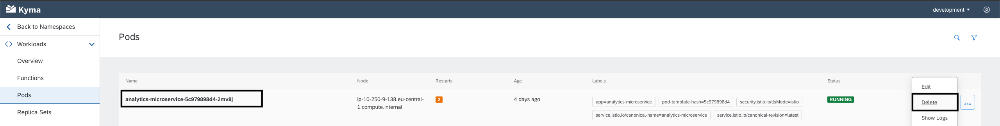

# Exercise 4 - Implementing Extension Scenario 2: Microservice

In this exercise you will help JonDoe electronics by implementing the second extension scenario discussed earlier. You will create an Expressjs-based microservice that will expose several API endpoints providing common statistics on the orders.

# Exercise 4.1 - Bootstrap The Project

As a first step, you will bootstrap the skeleton of the Expressjs application.

1. Create an empty folder and name it `analytics-microservice`. This folder will contain all your project files.

2. An Express application is essentially a Node.js application, so let's begin by creating an npm package inside the folder. Run the command `npm init` and complete the wizard.


3. You should now see a `package.json` file generated inside the project. Great job, your Node project is progressing!


4. The next step is to create a file called `index.js` in the root of the folder. This file will be the main entrypoint of our microservice.

5. Next, let's add the projects dependencies. In a terminal inside the project foler run: `npm i express cors handy-redis redis`. `redis` and `handy-redis` should look familiar - you used them in the Kyma Function aswell!

6. Check your `package.json` file. If successful, the content should be similar to:

**_analytics-microservice/package.json_**

```json
{
  "name": "analytics-microservice",
  "version": "1.0.0",
  "description": "TechEd261",
  "main": "index.js",
  "scripts": {
    "test": "echo \"Error: no test specified\" && exit 1"
  },
  "author": "<your name>",
  "license": "ISC",
  "dependencies": {
    "body-parser": "^1.19.0",
    "cors": "^2.8.5",
    "express": "^4.17.1",
    "handy-redis": "^2.3.1",
    "redis": "^3.1.2"
  }
}
```

7. Now let's add some basic code to the microservice and make it runnable. Add this code in your `index.js`:

**_analytics-microservice/index.js_**

```js
// Import the libraries
const express = require("express");
const hredis = require("handy-redis");
const cors = require("cors");

// Create express app
const app = express();
const PORT = 8080;

// Allow cross-origin requests - you might need this for local testing
app.use(cors());

// Sample endpoint for testing
app.get("/hello-world", async (req, res) => {
  res.status(200).send({ message: "Hello World!" });
});

// Off we go!
app.listen(PORT, () => {
  console.log(`Microservice listening at port ${PORT}.`);
});
```

8. Time to run the code. Inside a terminal in the project folder run: `node index.js` and look for the output `Microservice listening at port ${PORT}.`
9. Let's confirm that the microservice is alive and well. Go in your favourite browser and type in the URL bar: `http://localhost:8080/hello-world`.


If you see the same response in your screen, congratulations! You have successfully bootstrapped our microservice.

10. To be in line with best-practices, as a final step, add this line to your `package.json` file under `scripts` section:

```js
  "start": "node index.js",
```

Now you can easily run the server using the `npm run start` command in your terminal.

# Exercise 4.2 - Dockerize The Microservice

The goal now is to connect this new service with the Redis cache located in the Kyma runtime. To achieve that, you need to deploy the Express.js server in Kyma before moving on with the rest. Since Kyma is Kubernetes-based, a new deployment means we should start with a Docker image of the service. Let's Dockerize!

1. Inside the root of the project folder create two files named `Dockerfile` and `.dockerignore`.
2. Add the following code to your `Dockerfile`:

_**analytics-microservice/Dockerfile**_

```js
FROM node:11-alpine

RUN mkdir -p /usr/src/app

WORKDIR /usr/src/app

COPY . .

RUN npm install

EXPOSE 8080

CMD ["npm", "run", "start"]
```

The above is a pretty standard Dockerfile to containerize a Nodejs application. It is basically doing three things:

- Start from a lightweight Nodejs container layer
- Move all the project files to a specific folder and run `npm install` inside the container
- Expose port 8080 and run `npm run start`

3. Add the following code to the `.dockerignore`

_**analytics-microservice/.dockerignore**_

```
node_modules
```

This will prevent our local libraries from being copied over to the Docker container. We don't need them as we install these libraries in the container separately. `node_modules` can contain binaries compiled for your host OS, and if it’s different then the container OS, you’ll get errors trying to run your app.

4. Time to build the Docker image and push it to Dockerhub. Let's write the deployment script by creating a file named `Makefile` inside your project repo.

5. Paste the following code inside your `Makefile` and replace `<your-name>` with, well, your name. Make sure you run `docker login` beforehand!

```Makefile
deploy:
	docker build -t <your-name>/analytics-microservice -f Dockerfile . && docker push <your-name>/analytics-microservice
```

_**Note: If you don't have a Docker account to push your images don't worry! We will also provide an image for the rest of the exercises.**_

6. Test out the deployment by running `make deploy` on a terminal inside the folder and watch for the output.


# Exercise 4.3 - Time For Kubernetes

With Docker out of the way, let's deploy the service to Kyma. We'll begin by implementing the necessary K8s files.

1.  Create a new folder called `k8s` inside the project folder.

2.  As a first step we would like to inject some environment variables to the microservice. In Kubernetes, there are two resources that enable you to do this: `ConfigMap` and `Secret`. As a best practice, all sensitive environment variables should be injected via a `Secret` and the rest of the variables are to be injected through a `ConfigMap`. Let's begin!

Create a file called `configmap.yaml` and add the following code:

_**analytics-microservice/k8s/configmap.yaml**_

```yaml
apiVersion: v1
kind: ConfigMap
metadata:
  name: analytics-microservice
  labels:
    app: analytics-microservice
data:
  host: redis.development.svc.cluster.local
  port: "6379"
```

Create a file called `secret.yaml` and add the following code:

_**analytics-microservice/k8s/secret.yaml**_

```yaml
apiVersion: v1
kind: Secret
metadata:
  name: analytics-microservice
  labels:
    app: analytics-microservice
type: Opaque
data:
  password: "kPppOZp2hC"
```

3. Next, let's implement the `Deployment` that will create the Pods, and the `Service` that exposes these Pods for use. Create a file called `deployment.yaml` and add the following code:

_**analytics-microservice/k8s/deployment.yaml**_

```yaml
apiVersion: apps/v1
kind: Deployment
metadata:
  name: analytics-microservice
  labels:
    app: analytics-microservice
spec:
  replicas: 1
  selector:
    matchLabels:
      app: analytics-microservice
  template:
    metadata:
      labels:
        app: analytics-microservice
    spec:
      containers:
        - image: ddaja/analytics-microservice:latest # if you managed to deploy your own Docker image, replace this string
          imagePullPolicy: Always # pull a new image on every container creation
          name: analytics-microservice
          ports:
            - name: http
              containerPort: 8080 # the port exposed from the container
          env:
            - name: host
              valueFrom:
                configMapKeyRef: # get hostname from configMap
                  name: analytics-microservice
                  key: host
            - name: port
              valueFrom:
                configMapKeyRef:
                  name: analytics-microservice
                  key: port : # get port from configMap
            - name: password
              valueFrom:
                secretKeyRef:
                  name: analytics-microservice
                  key: password # get password from Secret
```

In the same file, add the service implementation as below:

```yaml
---
apiVersion: v1
kind: Service
metadata:
  name: analytics-microservice
  labels:
    app: analytics-microservice
spec:
  ports:
    - name: http
      port: 8080
      targetPort: 8080
      protocol: TCP
  selector:
    app: analytics-microservice
```

4. Finally, we need to make this deployed microservice accessible to the outside world. As an Ingress, we will use the Kyma APIRule, so create a file called `apirule.yaml` and add the code below:

_**analytics-microservice/k8s/apirule.yaml**_

```yaml
apiVersion: gateway.kyma-project.io/v1alpha1
kind: APIRule
metadata:
  name: analytics-microservice
spec:
  gateway: kyma-gateway.kyma-system.svc.cluster.local
  rules:
    - path: /average|/highest|/lowest|/keys|/delete # endpoints that will be implemented in the microservice
      accessStrategies:
        - config: {}
          handler: noop
      methods:
        - GET # all routes are accessible via GET
  service:
    host: analytics-microservice # requests will route to analytics-microservice service
    name: analytics-microservice
    port: 8080
```

# Exercise 4.4 - Deploy Resources Into Kyma

Let's deploy our newly created resources. Go to the `Overview > Deploy new workload > Upload YAML` and deploy the services in the following order:

1. `configmap.yaml`
2. `secret.yaml`
3. `deployment.yaml`
4. `apirule.yaml`

Check that all Deployments and Pods are successfully created in the `Overview > Healthy Resources` section.


# Exercise 4.5 - Implement The Rest of The Microservice

Let's add the rest of the implementation in our `index.js` file.

1. Add the connection to Redis as shown below:

```js
const client = hredis.createNodeRedisClient({
  port: process.env["port"],
  host: process.env["host"],
  password: process.env["password"],
});
```

2. At the end of the file, add the following helper function:

```js
async function getResultFromCache() {
  try {
    const keys = await client.keys("*"); // retrieve all keys stored in Redis
    let values = [];

    for (let i = 0; i < keys.length; i++) {
      const value = await client.hgetall(keys[i]); // Get values for particular key
      values = [...values, value]; // Add in values array
    }

    return values;
  } catch (err) {
    throw new Error(err);
  }
}
```

> This function will return to us all the product values currently stored in the Redis cache.

4. Add a helper endpoint:

```js
app.get("/keys", async (req, res) => {
  const keys = await client.keys("*");
  res.status(200).send({ keys });
});
```

> This endpoint will enable us to see which product keys are currently stored in the cache. We will use this endpoint continuously in the next steps!

5. Time to redeploy the microservice with our latest changes. As with every redeployment, there are two steps to the process:

- Run `make deploy` in the project folder.
- Once successfully deployed, delete the `analytics-microservice` Pod so it gets recreated and pulls the latest image. This was configure back in the Deployment option `imagePullPolicy: Always`.



6. Before we implement some simple analytics endpoints, let's clear out our Redis cache to start with a clean slate. Go to `Pods`, click on the three dots on the `redis-xyz-xyz` Pod and `Delete`.


7. Time to test our new endpoint through the `APIRule`. Go to `API Rules` and find the URL of the `analytics-microservice`. Open the URL in a new tab and attach the endpoint `/keys` at the end. The resulting URL and result should be similar to:


> We see we don't have any keys stored in the Cache because we already cleared it in the previous step.

8. Make two additional orders in CCv2 and check the `/keys` endpoint. **Keep an eye on the prices, we will make some statistics on them!** Depending on the products you bought, you should see something similar:


> We are now ready to implement some endpoints and play around with the product prices.

9. Let's add three endpoints to our microservice, namely `/average` `/highest` `/lowest`.

```js
app.get("/average", async (req, res) => {
  try {
    const values = await getResultFromCache(); // Get all values of bought products from the cache

    const sum = values
      .map((value) => parseFloat(value.orderValue))
      .reduce((acc, cur) => acc + cur, 0); // Calculate the sum of all prices

    res.status(200).send({ message: "Success.", result: sum / values.length }); // Return the sum / number of items
  } catch (err) {
    res.status(500).send({ message: "Something went wrong." });
  }
});
```

> This function will return to us the average buy price of all ordered products.

```js
app.get("/highest", async (req, res) => {
  try {
    const values = await getResultFromCache(); // Get all values of bought products from the cache
    const last = values.length - 1;

    const highest = values.map((value) => parseFloat(value.orderValue)).sort()[
      last
    ]; // Sort items in ascending order and get last item which results in the highest value

    res.status(200).send({ message: "Success.", result: highest });
  } catch (err) {
    res.status(500).send({ message: "Something went wrong." });
  }
});
```

> This function will return to us the highest price from all ordered products.

```js
app.get("/lowest", async (req, res) => {
  try {
    const values = await getResultFromCache(); // Get all values of bought products from the cache
    const lowest = values
      .map((value) => parseFloat(value.orderValue))
      .sort()[0]; // Sort items in ascending order and get first item which results in the highest value

    res.status(200).send({ message: "Success.", result: lowest });
  } catch (err) {
    res.status(500).send({ message: "Something went wrong." });
  }
});
```

> This function will return to us the lowest price from all ordered products.

10. If you followed through this tutorial successfully, your code should look similar to this:

```js
const express = require("express");
const hredis = require("handy-redis");
const cors = require("cors");

const app = express();
const PORT = 8080;

const client = hredis.createNodeRedisClient({
  port: process.env["port"],
  host: process.env["host"],
  password: process.env["password"],
});

app.use(cors());

app.get("/average", async (req, res) => {
  try {
    const values = await getResultFromCache();

    const sum = values
      .map((value) => parseFloat(value.orderValue))
      .reduce((acc, cur) => acc + cur, 0);

    res.status(200).send({ message: "Success.", result: sum / values.length });
  } catch (err) {
    res.status(500).send({ message: "Something went wrong." });
  }
});

app.get("/highest", async (req, res) => {
  try {
    const values = await getResultFromCache();
    const last = values.length - 1;

    const highest = values.map((value) => parseFloat(value.orderValue)).sort()[
      last
    ];

    res.status(200).send({ message: "Success.", result: highest });
  } catch (err) {
    res.status(500).send({ message: "Something went wrong." });
  }
});

app.get("/lowest", async (req, res) => {
  try {
    const values = await getResultFromCache();
    const lowest = values
      .map((value) => parseFloat(value.orderValue))
      .sort()[0];

    res.status(200).send({ message: "Success.", result: lowest });
  } catch (err) {
    res.status(500).send({ message: "Something went wrong." });
  }
});

app.get("/keys", async (req, res) => {
  const keys = await client.keys("*");
  res.status(200).send({ keys });
});

async function getResultFromCache() {
  try {
    const keys = await client.keys("*");
    let values = [];

    for (let i = 0; i < keys.length; i++) {
      const value = await client.hgetall(keys[i]);
      values = [...values, value];
    }

    return values;
  } catch (err) {
    throw new Error(err);
  }
}

app.listen(PORT, () => {
  console.log(`Microservice listening at port ${PORT}.`);
});
```

# Exercise 4.6 - Redeploy And Test Our Endpoints

1. Redeploy the microservice by following the same steps as we did earlier:

- Run `make deploy` in the project folder.
- Once successfully deployed, delete the `analytics-microservice` Pod so it gets recreated and pulls the latest image.

2. Test the endpoints!

-> `/average` - based on the products you bought, you should see the average price of both.


-> `/highest` - based on the products you bought, you should see the highest price.


-> `/lowest` - based on the products you bought, you should see the lowest price.


## Summary

Hooray! You've successfully completed [Exercise 4 - Implementing Extension Scenario 2: Microservice](#exercise-4---implementing-extension-scenario-2:-microservice).

Continue to [(Bonus) Exercise 5 - Monitoring with Kyma built-in tools](../ex5/README.md).
