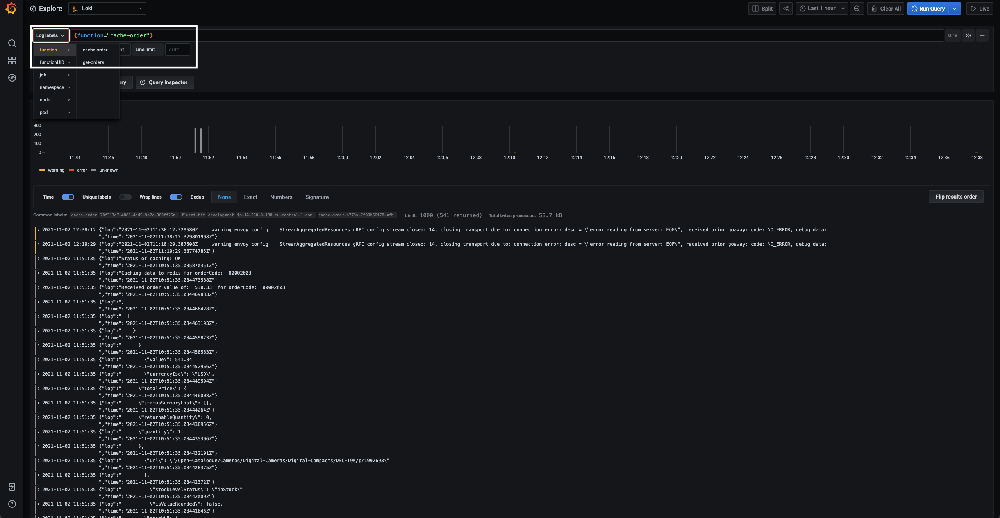
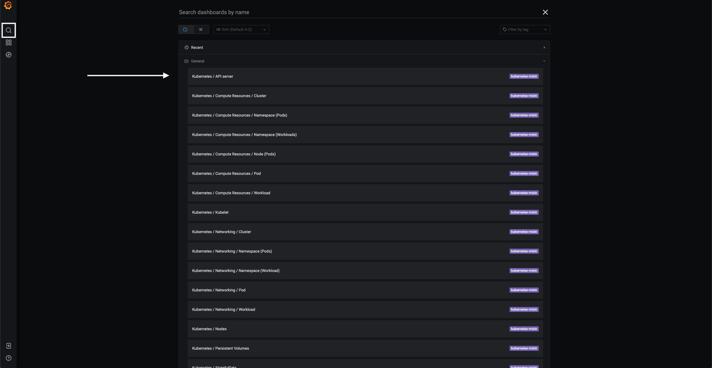
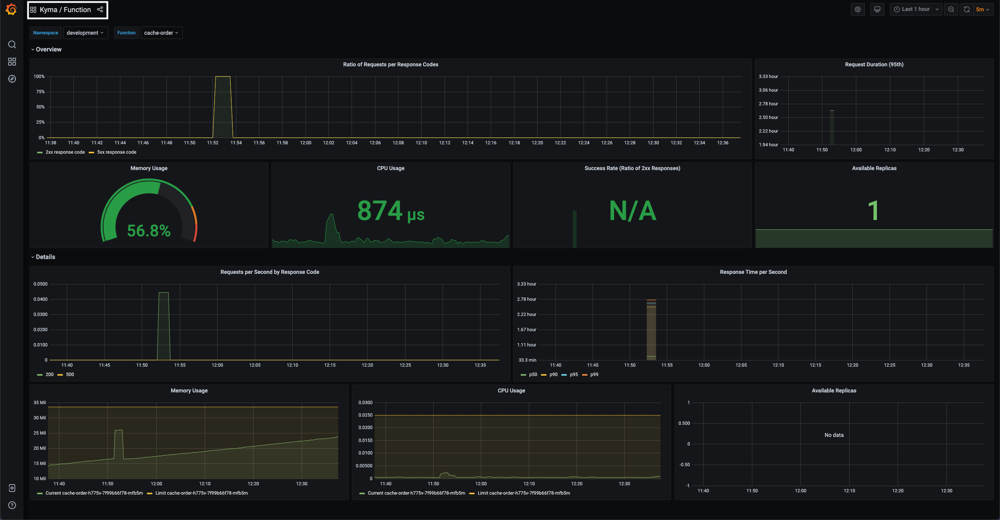
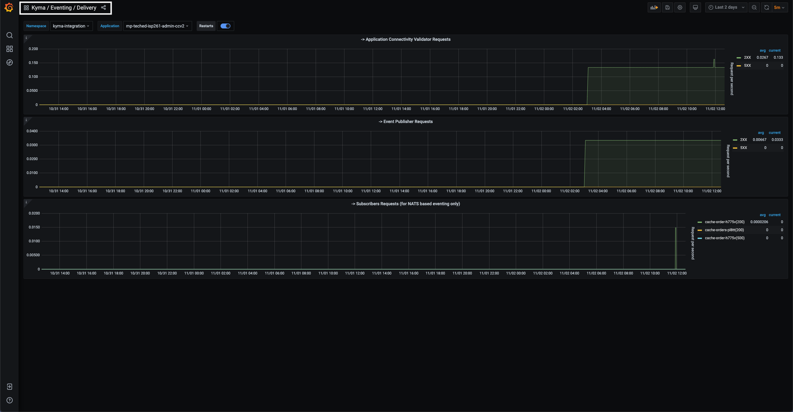

# (Bonus) Exercise 5 - Monitoring with Kyma built-in tools

As a bonus, self-service exercise, you will quickly go through the monitoring tools that Kyma provides like Grafana, Prometheus and Loki.

**This is not a guided exercise, so take your time and explore the variety of dashboards offered by Grafana inside the Kyma dashboard.**

# Exercise 5.1 - Open the monitoring tools

Before jumping into the dashboards, let's have a quick introduction of Grafana, Prometheus and Loki.

> Grafana is a general purpose dashboard and graph composer. It's focused on providing rich ways to visualize time series metrics, mainly though graphs but supports other ways to visualize data through a pluggable panel architecture. It currently has rich support for for Graphite, InfluxDB and OpenTSDB. But supports other data sources via plugins.

You can read much more on Grafana [here](https://grafana.com/docs/grafana/latest/getting-started/getting-started/).

> Loki is a horizontally-scalable, highly-available, multi-tenant log aggregation system inspired by Prometheus. It is designed to be very cost effective and easy to operate. It does not index the contents of the logs, but rather a set of labels for each log stream.

You can read more on Loki [here](https://grafana.com/docs/loki/latest/).

> Prometheus is an open-source service monitoring system and time series database, developed by SoundCloud. Prometheus is a systems and service monitoring system. It collects metrics from configured targets at given intervals, evaluates rule expressions, displays the results, and can trigger alerts if some condition is observed to be true.

You can read more on Prometheus [here](https://prometheus.io/docs/prometheus/latest/getting_started/).

**In order to start visualizing dashboards and logs in Grafana, go under the `Diagnostics` section and you will find `Logs` and `Metrics`.**

# Exercise 5.2 - Watch logs in Grafana and Loki

Clicking on the `Logs` tab will send you inside the Grafana Loki dashboard. In a nutshell, Loki is your go-to point to monitoring the Logs coming from any of your deployed services in Kyma.

As an example depicted below, you can find the logs coming from `cache-order` Function you deployed in the previous exercises. This is a obviously a better alternative to peeking into Pods to see logs - it offers a better visual experience and the opportunity to filter/query according to your requirements.

Feel free to explore Loki further in your own personal Kyma dashboard!

# Exercise 5.3 - Visualize metrics in Grafana and Prometheus

Clicking on the `Metrics` tab will send you into the main Grafana dashboard.

From there, you can click on the Search icon on the top-left and see a list of dashboards available to you out-of-the-box.

Depending on what your particular monitoring interests, you can enter into any of the dashboards listed. As an example depicted below, we go inside two dashboards, namely `Kyma/Function` and `Kyma/Eventing/Delivery` giving us details on Functions execution and CCv2->Kyma events respectively.

## Summary

Hooray! You've successfully completed [(Bonus) Exercise 5 - Monitoring with Kyma built-in tools](./ex5/README.md)

And now it's time to celebrate! By mastering this session you've reached the first level in becoming a Kyma expert.
